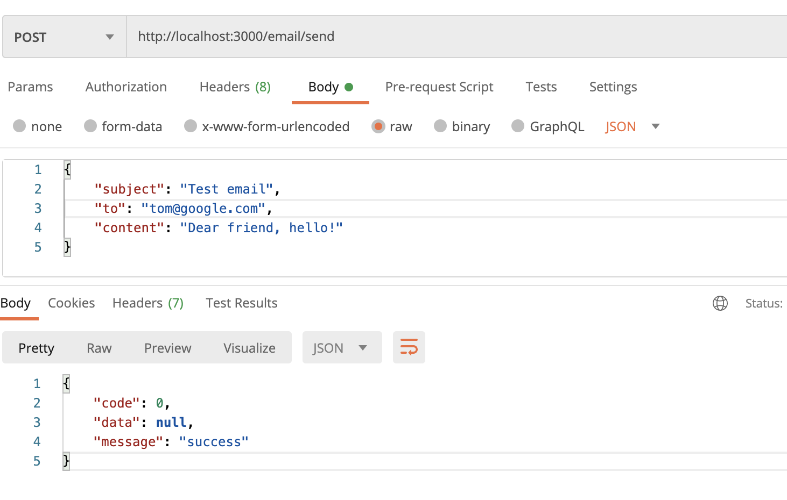
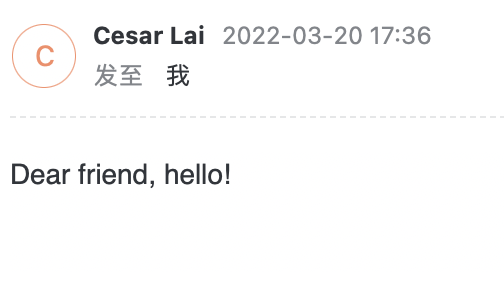
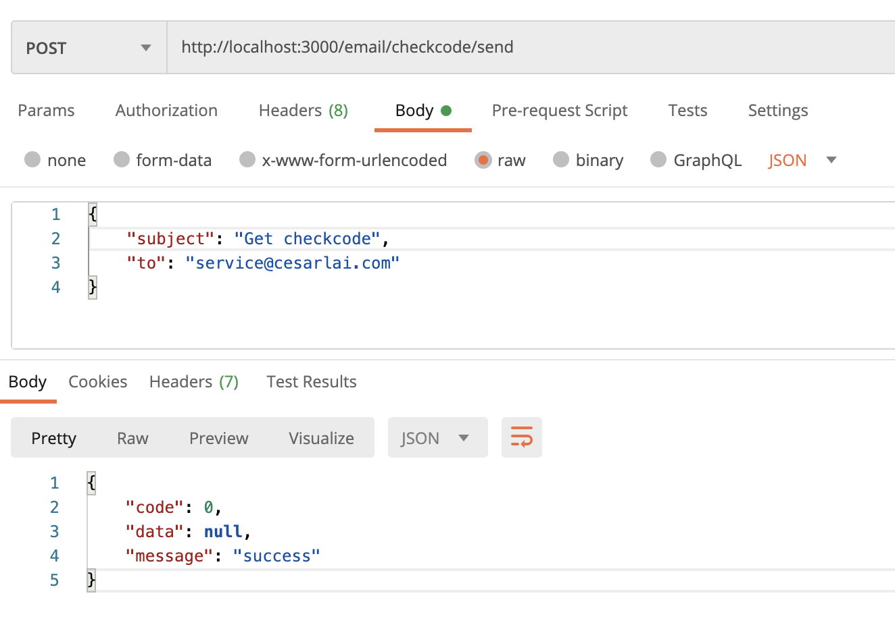
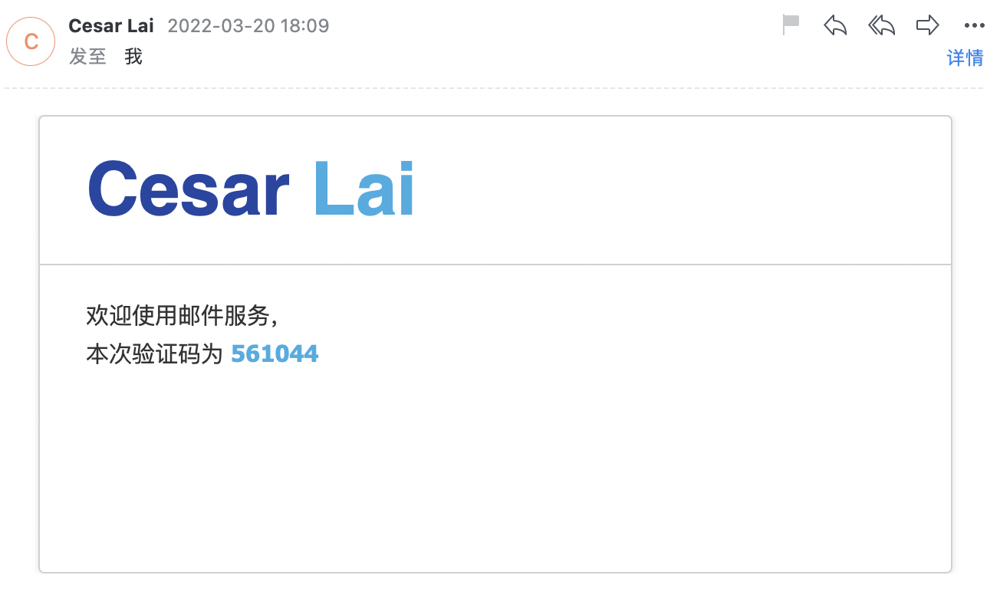

# email-server-example

NestJS 邮件服务示例。

## 环境变量配置

NestJS 提供 `ConfigModule` 模块，允许全局加载环境变量。

```typescript
import { Module } from '@nestjs/common';
import { ConfigModule } from '@nestjs/config';
import { EmailModule } from './email/email.module';

@Module({
  imports: [
    ConfigModule.forRoot({
      isGlobal: true,
      envFilePath: '.env',
    }),
    EmailModule,
  ],
  controllers: [],
  providers: [],
})
export class AppModule {}
```

与邮箱服务器相关的配置设置在 `.env` 文件中，可通过修改相关环境变量，完成邮箱服务的配置。

```txt
# EMAIL
EMAIL_SMTP_HOST=smtp.google.com
EMAIL_SMTP_PORT=465
EMAIL_SMTP_USER=sender@google.com
EMAIL_SMTP_PASS=email_paasword;
EMAIL_OP_FROM='sender <sender@google.com>'
EMAIL_OP_TO=receiver@google.com
```

## 邮箱服务实现

邮箱服务以 provider 的形式，封装在 `email.provider.ts` 文件中，其实现基于 nodemailer 。

邮件服务初始化

```typescript
/**
 * email/email.provider.ts
 */

init() {
  const envMap = getEnv();

  this.transporter = nodemailer.createTransport(
    smtpTransport({
      host: envMap.SMTP_HOST,
      port: Number.parseInt(envMap.SMTP_PORT, 10),
      secure: true,
      auth: {
        user: envMap.SMTP_USER,
        pass: envMap.SMTP_PASS,
      },
    }),
  );

  this.baseMailOptions = {
    from: envMap.OP_FROM,
    to: envMap.OP_TO,
  };
}
```

发送邮件

```typescript
sendEmail(options: MailerOptions): Promise<void> {
  const mailOptions = {
    ...this.baseMailOptions,
    ...options,
  };

  return new Promise<void>((resolve, reject) => {
    this.transporter.sendMail(mailOptions, (error, response) => {
      if (error) {
        // 发送邮件失败
        console.error(error);
        reject(error.message);
      } else {
        // 发送邮件成功
        console.log(response);
        resolve();
      }
      this.transporter.close();
    });
  });
}
```

## 邮件控制器实现

```typescript
import { Controller, Post, Body, Res } from '@nestjs/common';
import { Response } from 'express';
import { ResponseBody } from '@/common/models/response.model';
import { SendCheckcodeEmailDto } from './dto/send-checkcode-email.dto';
import { SendEmailDto } from './dto/send-email.dto';
import { EmailService } from './email.service';

@Controller('email')
export class EmailController {
  constructor(private readonly emailService: EmailService) {}

  @Post('/send')
  async sendEmail(
    @Body()
    body: SendEmailDto,
    @Res()
    res: Response,
  ): Promise<Response> {
    await this.emailService.sendEmail(body);
    return res.json(new ResponseBody(0, null, 'success'));
  }

  @Post('/checkcode/send')
  async sendCheckcode(
    @Body()
    body: SendCheckcodeEmailDto,
    @Res()
    res: Response,
  ): Promise<Response> {
    await this.emailService.sendCheckcodeEmail(body);
    return res.json(new ResponseBody(0, null, 'success'));
  }
}
```

## 效果

### 发送普通邮件





### 发送验证码邮件





## 注意事项

### nodemailer bug

在 TypeScript 环境下使用 `nodemailer` 的时候，可能会出现一个问题

```txt
[Nest] 20722  - 03/20/2022, 6:21:36 PM     LOG [NestFactory] Starting Nest application...
[Nest] 20722  - 03/20/2022, 6:21:36 PM   ERROR [ExceptionHandler] Cannot read property 'createTransport' of undefined
TypeError: Cannot read property 'createTransport' of undefined
    at EmailProvider.init (/Users/cesarlai/Personal/Repos/Public/nestjs-examples/examples/email-server-example/src/email/email.provider.ts:35:35)
```

抛出异常的地方在这里

```typescript
import nodemailer, { Transporter } from 'nodemailer';

export class EmailProvider {
  init() {
    const envMap = getEnv();

    // Cannot read property 'createTransport' of undefined
    this.transporter = nodemailer.createTransport(
      smtpTransport({
        ......
      }),
    );
  }
}
```

这里可能是因为 nodemailer 没有默认导出（export default）。

假设直接导出 `createTransport` 方法，此处依然会报错

```typescript
import { createTransport, Transporter } from 'nodemailer';

export class EmailProvider {
  init() {
    const envMap = getEnv();

    // TypeError: (0 , nodemailer_smtp_transport_1.default) is not a function
    this.transporter = createTransport(
      smtpTransport({
        ......
      }),
    );
  }
}
```

从这里可以看出，大概是 CommonJS 与 ES 模块冲突的问题

查看 nodemailer 的源码，可以发现 `createTransport` 的定义

```javascript
module.exports.createTransport = function (transporter, defaults) {
    let urlConfig;
    let options;
    let mailer;
    ...
}
```

一般 `module.exports` 导出的对象，如果转换成 ES 模块，会被作为默认导出

但由于 nodemailer 内部所有方法都是直接定义在 `module.exports` 上，而不是定义在一个对象上并赋值到 `module.exports` 

因此转换为 ES 模块时，无法从默认导出模块中获取到 `createTransport` 方法，也无法直接获取该方法。

### 解决办法

在 tsconfig.json 中，修改 `esModuleInterop` 属性为 **true**

```json
{
  "compilerOptions": {
    ...
    "esModuleInterop": true,
    ...
  },
  "exclude": ["node_modules", "dist"]
}
```

这个选项会改变 CommonJS 的导入方式，从而解决上面的问题。

```typescript
// 用法一
import nodemailer from 'nodemailer'
nodemailer.createTransport

// 用法二
import { createTransport } from 'nodemailer'
```