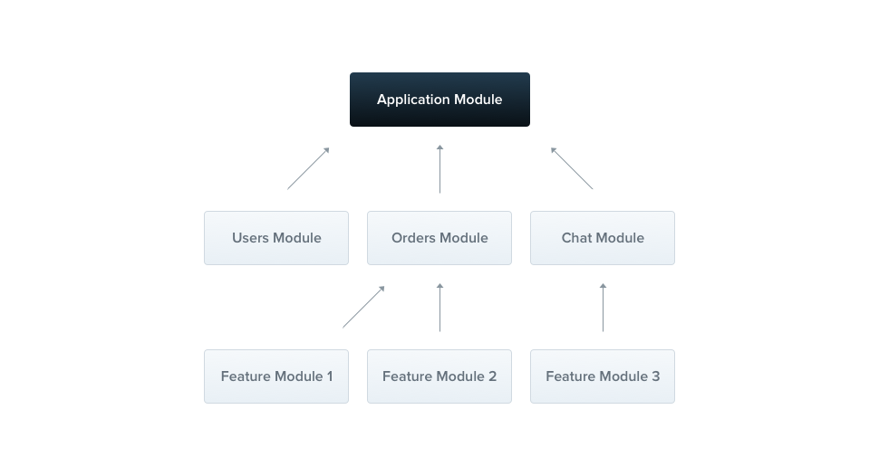
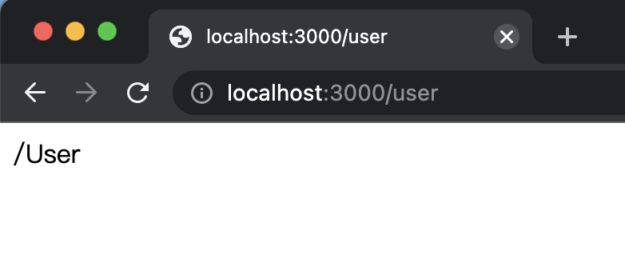
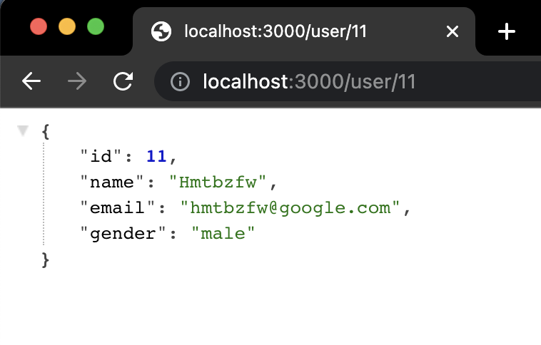
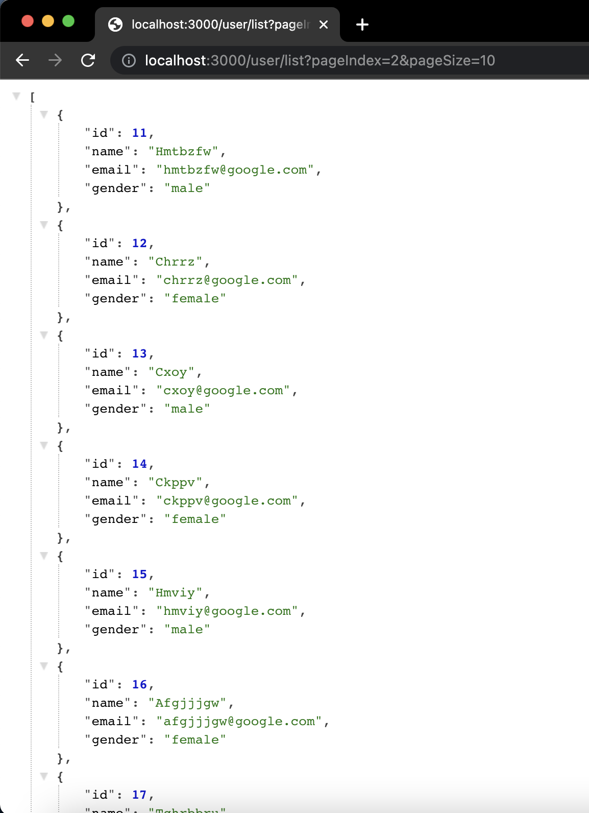

# simple-api-example

NestJS RESTful API 示例。

## 概述

RESTful 是一种网络应用程序的设计风格和开发方式，基于 HTTP ，可以使用 XML 格式定义或 JSON 格式定义。

对于一个服务器端应用而言，与客户端最常见的通信方式就是：
以 HTTP 资源的方式，暴露一个个具有不同职责的接口，客户端发送 HTTP 请求访问这些接口，从而与服务器端完成通信。而 RESTful 的规范，使得接口的定义更清晰，职责更明确。

## 概念说明

在介绍如何定义 RESTful 接口前，需要先简单介绍几个概念：

- Nest Module
- Nest Controller

### Nest Module

在 Nest 中，一个应用根据功能/职责的不同，将划分为多个相对独立的模块。这些相对独立的功能模块都注册在应用模块上，主要的功能实现都在各自的模块内部完成，模块与模块之间也可互相引用。
详情参考官网介绍：[模块](https://docs.nestjs.com/modules)。



### Nest Controller

而 Nest 中的控制器，属于模块的一部分，为了使控制器生效，需要在模块上进行注册。只有当控制器在当前模块完成注册，并且当前模块在应用模块上完成注册，控制器才算是真正生效。

当我们需要创建与用户相关的 `UserController` 时，只需要在 `UserModule` 内部的目录中创建 `user.controller.ts`，

## 创建 User 模块

下面创建一个 User 模块，用于实现与用户操作相关的功能。

可以是手动创建，也可以使用命令创建

```typescript
nest g module user
```

一个模块，至少包含一个 `*.module.ts` 文件，用于定义模块

```typescript
/**
 * user/user.module.ts
 */

import { Module } from '@nestjs/common';

@Module({
  imports: [],
  controllers: [],
  providers: [],
  exports: [],
})
export class UserModule {}
```

在这个文件里，可以注册控制器，注册 Provider，可以导入其他模块，也可以导出 Provider 给其他模块使用。
关于 Provider 的概念，可以参考 [Provider](https://docs.nestjs.com/providers) 。

## 实现 RESTful 接口

### Controller

为了实现与 User 相关的接口，需要在 user 目录中，创建 `user.controller.ts` 文件。

```typescript
/**
 * user/user.controller.ts
 */

import { Controller, Get } from '@nestjs/common';

@Controller('user')
export class UserController {
  constructor() {}

  @Get()
  index(): string {
    return '/User';
  }
}
```

Nest 与其他服务器端框架一样，支持 AOP 编程思想，其提供了大量有用的装饰器，方便灵活的应用一些功能。

在 Nest 中，`@Controller`装饰器用于修饰一个控制器 class 类，可以将控制器的根路由作为参数，传递到装饰器当中，不传默认为 `/`，意味着根路由。在上面的例子中，就定义了一个路径为 `/user` 的控制器。

### Get

在控制器当中，为了标识某一个路由方法使用的 HTTP 方法，可以使用同名的装饰器对路由方法进行修饰。与`@Controller`类似，HTTP 方法装饰器也可以定义路由的路径。在上面的例子中，index 方法就是一个使用了 HTTP GET 方法的路由，路由的路径为 `/user`，返回的内容是 **/User** 字符串。



### Req/Res

为了获取请求和响应信息，可以使用`@Req`和`@Res`装饰器。

```typescript
import { Controller, Get, Req, Res } from '@nestjs/common';
import { Request, Response } from 'express';

@Controller('user')
export class UserController {
  constructor() {}

  @Get()
  index(@Req() req: Request, @Res() res: Response): string {
    return '/User';
  }
}
```

Nest 本身是一个将底层抽象的框架，但由于默认使用 Express 作为底层 HTTP 服务实现，因此通过装饰器获取的 `req` 和 `res` 对象，实际上是 Express 的 Request 和 Response 对象。

取到 req 对象后，可以获取与请求相关的信息，例如：

- header
- ip
- body
- cookie
- url
- host

取到 res 对象后，可以根据需要对响应的 body、header、cookie 等内容进行修改，响应的数据也可以是文本、JSON/XML、文件流、HTML 文档等等。

```typescript
// 返回 JSON

@Get('/:id')
getUserById(@Param('id') id: string, @Res() res: Response): Response {
  const user = this.userService.getUserById(Number.parseInt(id));
  // 此处等价于 return res.json(user);
  return res.send(user);
}
```

```typescript
@Get('/:id')
getUserById(@Param('id') id: string, @Res() res: Response): Response {
  const user = this.userService.getUserById(Number.parseInt(id));
  // 设置 Header
  return res.setHeader('user-id', id).send(user);
}
```

### Param/Query

对于一个 RESTful 的路由，通过 URL 传参的方式有两种：

1. 动态路由参数（参数作为路由的一部分）；
1. 跟随在问号后的 query 参数。

在 Nest 中，可以分别使用 `@Param` 和 `@Query` 装饰器获取两种不同的参数。

```typescript
// 使用 @Param 获取动态参数

@Get('/:id')
getUserById(@Param('id') id: string, @Res() res: Response): Response {
  const user = this.userService.getUserById(Number.parseInt(id));
  return res.send(user);
}
```



```typescript
// 使用 @Query 获取请求参数

@Get('/list')
getUsers(
  @Query('pageIndex') pageIndex: string,
  @Query('pageSize') pageSize: string,
  @Res() res: Response,
): Response {
  const users = this.userService.list({
    pageIndex: Number.parseInt(pageIndex),
    pageSize: Number.parseInt(pageSize),
  });
  return res.send(users);
}
```



### Body

上面的分页接口是使用 GET 方法实现的，下面用 POST 方法实现。

```typescript
@Post('/list')
getUsersWithPost(
  @Body() body: GetUsersWithPostDto,
  @Res() res: Response,
): Response {
  const users = this.userService.list({
    pageIndex: body.pageIndex,
    pageSize: body.pageSize,
  });
  return res.json(users);
}
```

这里的路由地址同样是 list ，由于路由受 **HTTP 方法**和**路由地址**两个条件约束，所以这个路由方法不会与 HTTP 方法为 GET 的路由方法冲突。

为了拿到请求体的内容，可以使用 `@Body` 装饰器（也可以使用 req.body 获取请求体的内容，只是需要自己去解析内容），同时由于 Nest 也可以采用领域驱动模型进行开发，因此可以为请求体定义对应的 DTO。

```typescript
/**
 * user/dto/get-users-with-post.dto.ts
 */

export interface GetUsersWithPostDto {
  pageIndex: number;
  pageSize: number;
}
```

按照 HTTP 规则，除了 POST 方法，PUT 方法也可以使用 `@Body` 装饰器获取请求体，这里就不再演示。
